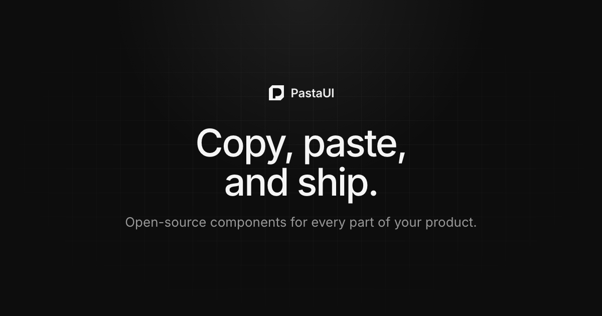

# Pasta UI

Open-source React components for every part of your product. Copy, paste, and ship.

[Website](https://pastaui.com) · [Components](https://pastaui.com/docs/component) · [Installation](https://pastaui.com/docs/installation) · [Pro](https://pro.pastaui.com)



## Features

- Built with React, Tailwind CSS, and shadcn/ui
- Installed with the shadcn CLI, so the source lives in your project
- Polished defaults with light and dark mode
- Free and MIT licensed

## Usage

Set up shadcn in a React project using Tailwind CSS:

```bash
pnpm dlx shadcn@latest init
```

Then add any component from its page on [pastaui.com](https://pastaui.com/docs/component):

```bash
pnpm dlx shadcn@latest add https://pastaui.com/r/plan-approval-card.json
```

The component is copied into your project. Import it, follow the usage example, and edit it to match your product.

## Agent skills

Skills that teach coding agents like Claude Code how to use Pasta UI live in [`skills/`](skills):

- [`pastaui-pro`](skills/pastaui-pro/SKILL.md): sign up for [Pasta UI Pro](https://pro.pastaui.com) and install its blocks from the private registry.

Install them with the [skills](https://skills.sh) CLI:

```bash
npx skills add syeddhasnainn/pastaui
```

## Development

```bash
pnpm install
pnpm dev
```

| Command               | Description                               |
| --------------------- | ----------------------------------------- |
| `pnpm dev`            | Start the dev server on port 3000         |
| `pnpm build`          | Build for production                      |
| `pnpm check`          | Lint, typecheck, and check formatting     |
| `pnpm registry:build` | Build the shadcn registry into `public/r` |

The site is built with [TanStack Start](https://tanstack.com/start) and deployed to Cloudflare Workers.

## Contributing

Bug reports, component requests, and pull requests are welcome. Open an [issue](https://github.com/syeddhasnainn/pastaui/issues) to get started.

## License

[MIT](LICENSE)
